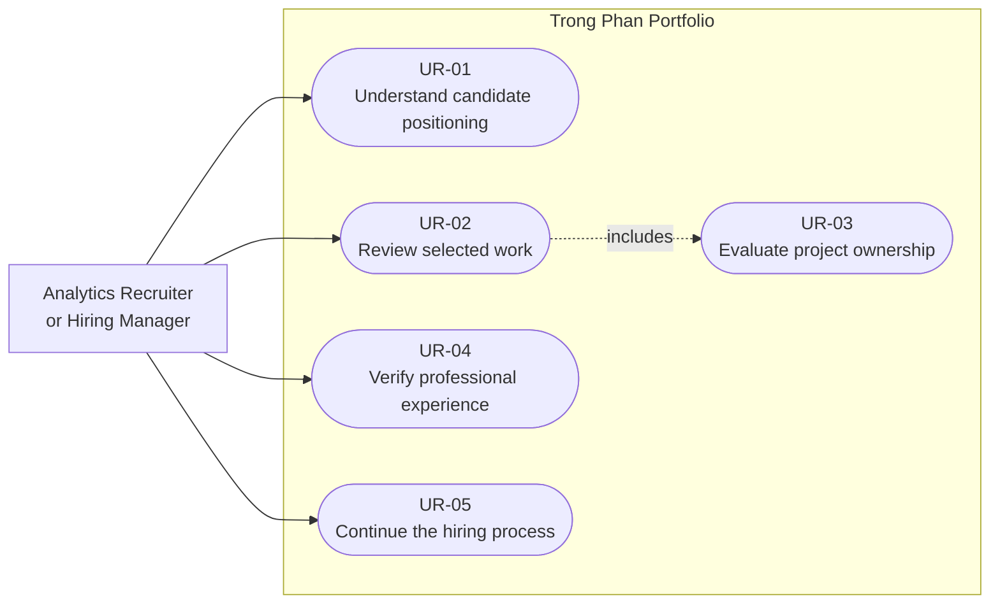

# Portfolio User Requirements

## Primary actor

Analytics recruiter or hiring manager.

## Functional requirements

### UR-01: Understand candidate positioning

The visitor must be able to identify my specialization, professional level, and availability from the first viewport.

### UR-02: Review selected work

The visitor must be able to open an evidence-backed case study from the homepage.

### UR-03: Evaluate project ownership

Each case study must explain my responsibilities, methods, validation, results, limitations, and use of AI assistance.

### UR-04: Verify professional experience

The visitor must be able to review my relevant employment, research experience, education, and technical capabilities.

### UR-05: Continue the hiring process

The visitor must be able to download my résumé, visit my GitHub or LinkedIn profile, and contact me.

## Use-case model

